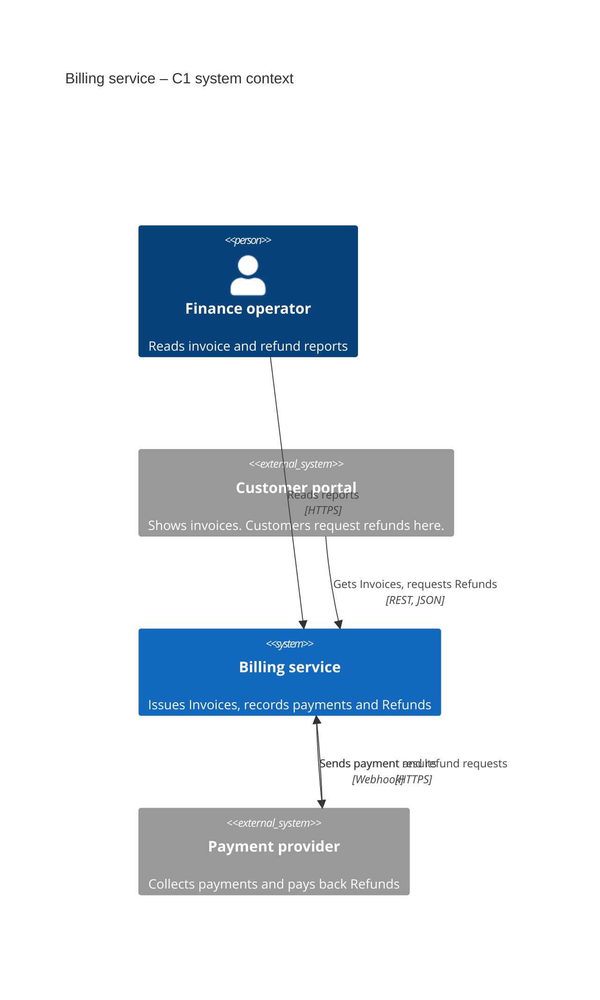

# Billing service – C1

Evidence for deployable system: repository root. Actor roles: person: Finance domain expert (example).

```mermaid
C4Context
  title Billing service – C1 system context
  Person(finance, "Finance operator", "Reads invoice and refund reports")
  System_Ext(portal, "Customer portal", "Shows invoices. Customers request refunds here.")
  System(billing, "Billing service", "Issues Invoices, records payments and Refunds")
  System_Ext(provider, "Payment provider", "Collects payments and pays back Refunds")
  Rel(finance, billing, "Reads reports", "HTTPS")
  Rel(portal, billing, "Gets Invoices, requests Refunds", "REST, JSON")
  Rel(billing, provider, "Sends payment and refund requests", "HTTPS")
  Rel(provider, billing, "Sends payment results", "Webhook")
```
