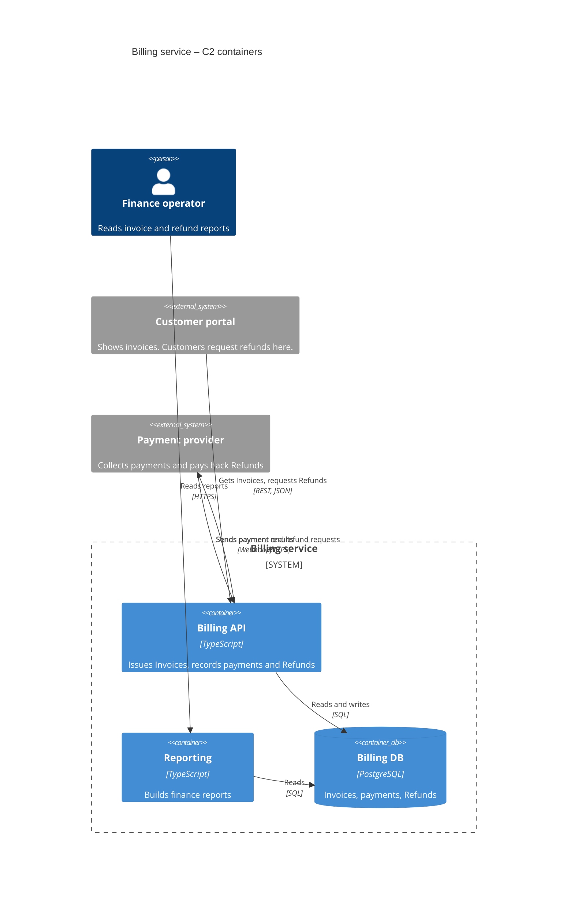

# Billing service – C2

Evidence for containers: deployment files and entry points in the example case study. Unconfirmed items must stay marked until a person confirms them.

```mermaid
C4Container
  title Billing service – C2 containers
  Person(finance, "Finance operator", "Reads invoice and refund reports")
  System_Ext(portal, "Customer portal", "Shows invoices. Customers request refunds here.")
  System_Ext(provider, "Payment provider", "Collects payments and pays back Refunds")
  System_Boundary(b, "Billing service") {
    Container(api, "Billing API", "TypeScript", "Issues Invoices, records payments and Refunds")
    Container(reports, "Reporting", "TypeScript", "Builds finance reports")
    ContainerDb(db, "Billing DB", "PostgreSQL", "Invoices, payments, Refunds")
  }
  Rel(finance, reports, "Reads reports", "HTTPS")
  Rel(portal, api, "Gets Invoices, requests Refunds", "REST, JSON")
  Rel(api, db, "Reads and writes", "SQL")
  Rel(reports, db, "Reads", "SQL")
  Rel(api, provider, "Sends payment and refund requests", "HTTPS")
  Rel(provider, api, "Sends payment results", "Webhook")
```
