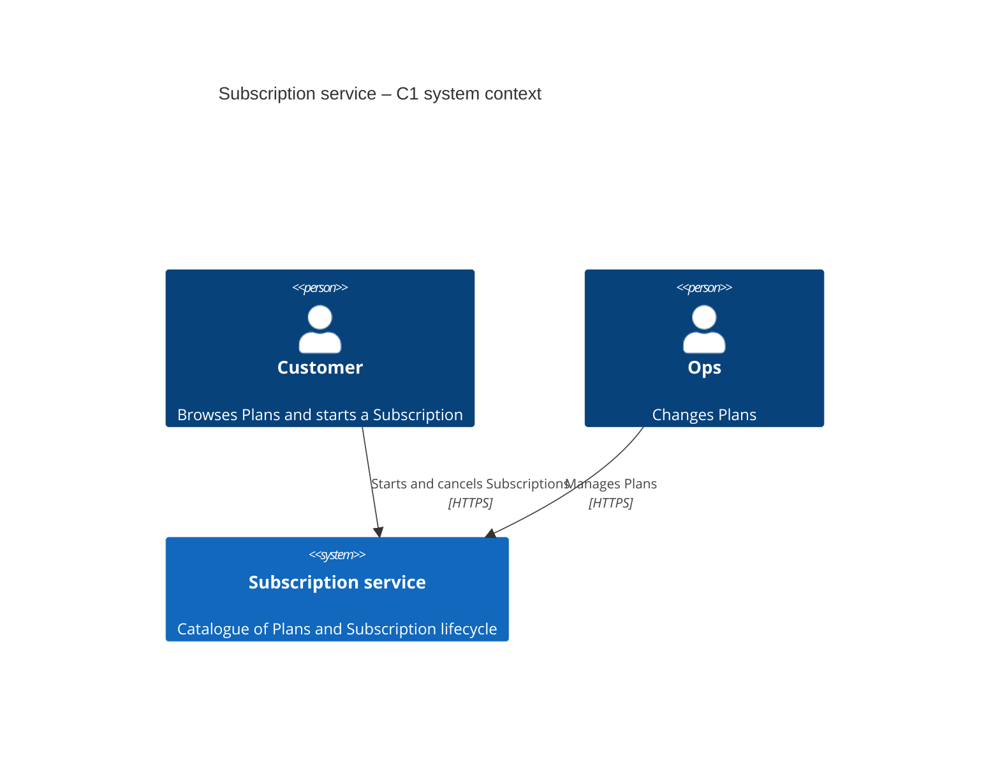

# Subscriptions – C1

Drafted by an agent in the Define stage. A person confirmed actor labels.

```mermaid
C4Context
  title Subscription service – C1 system context
  Person(customer, "Customer", "Browses Plans and starts a Subscription")
  Person(ops, "Ops", "Changes Plans")
  System(subs, "Subscription service", "Catalogue of Plans and Subscription lifecycle")
  Rel(customer, subs, "Starts and cancels Subscriptions", "HTTPS")
  Rel(ops, subs, "Manages Plans", "HTTPS")
```
