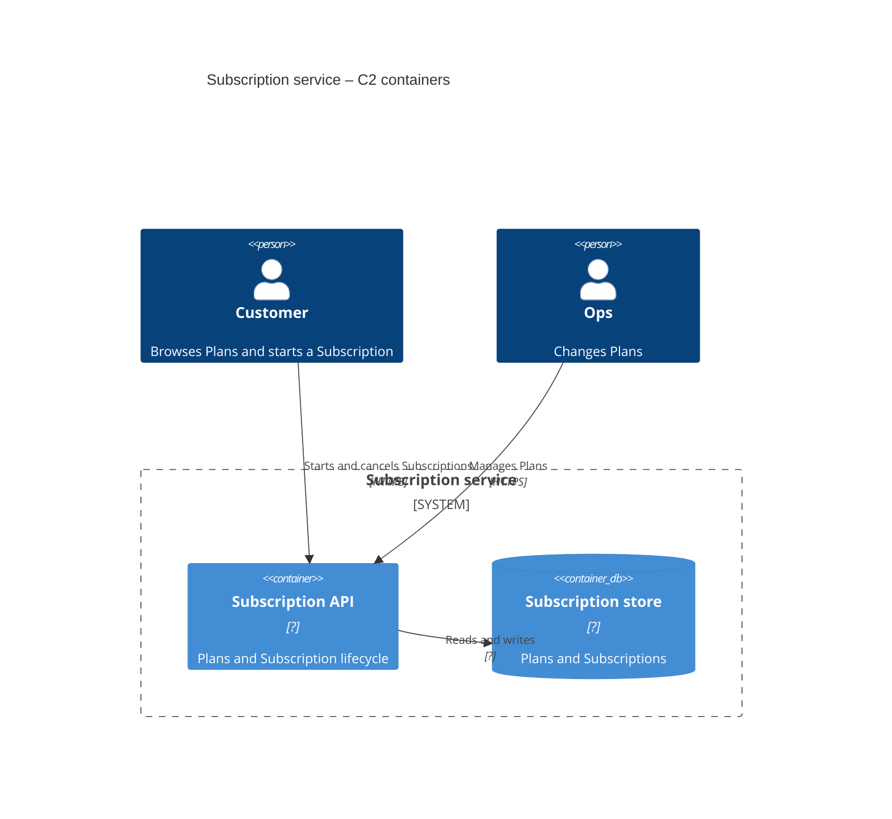

# Subscriptions – C2

```mermaid
C4Container
  title Subscription service – C2 containers
  Person(customer, "Customer", "Browses Plans and starts a Subscription")
  Person(ops, "Ops", "Changes Plans")
  System_Boundary(b, "Subscription service") {
    Container(api, "Subscription API", "?", "Plans and Subscription lifecycle")
    ContainerDb(db, "Subscription store", "?", "Plans and Subscriptions")
  }
  Rel(customer, api, "Starts and cancels Subscriptions", "HTTPS")
  Rel(ops, api, "Manages Plans", "HTTPS")
  Rel(api, db, "Reads and writes", "?")
```
